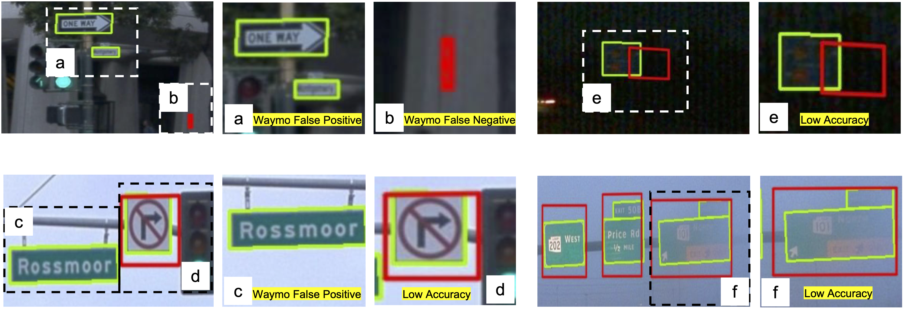
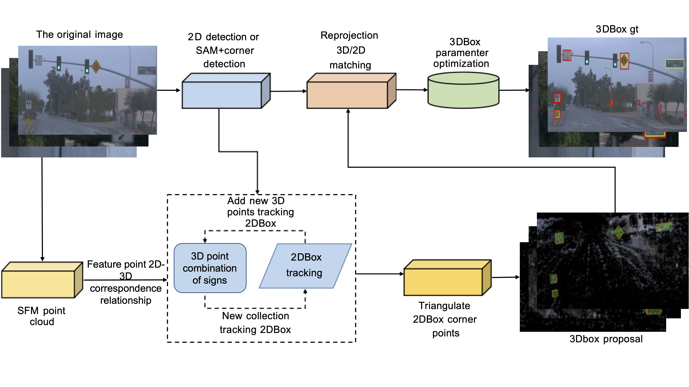
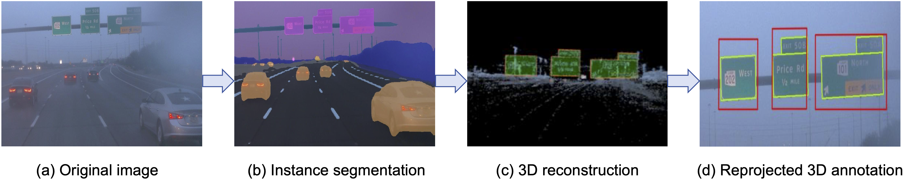

# VRSO

**VRSO**: **V**isual-Centric **R**econstruction for **S**tatic **O**bject Annotation

[Arxiv](https://arxiv.org/pdf/2403.15026.pdf) | [Youtube](https://www.youtube.com/watch?v=hhfTyvTEYMM) | [Bilibili](https://www.bilibili.com/video/BV1tPiVeNEyX/?spm_id_from=333.999.0.0&vd_source=34df4267be146d2dde6e0bf98a2ce363)

waymo example:  

  

Comparison between our proposed VRSO (green) and Waymo (red) annotations after reprojection (from 3D space to 2D images). All images are from the Waymo Open Dataset (WOD). We can easily observe the reprojection errors (false positives and false negatives) among the Waymo annotations. For instance, the traffic signs (in both full and zoomed regions) are ignored or wrongly labelled in (a) and (c), while the red boxes do not tightly cover the targets in (b) and (d). Differently, VRSO yields consistent and accurate annotation among all images, even in low-resolution and illuminance conditions (b).

## Pipeline

  
  

